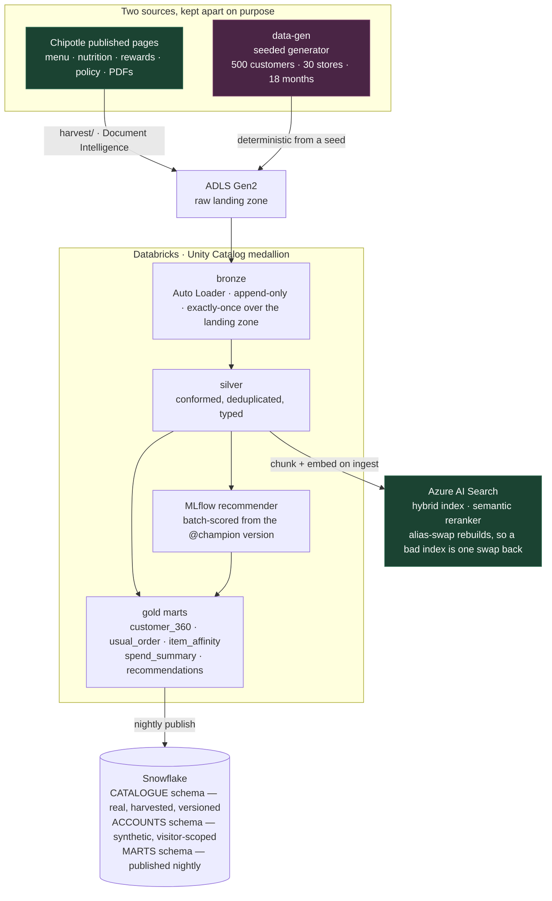
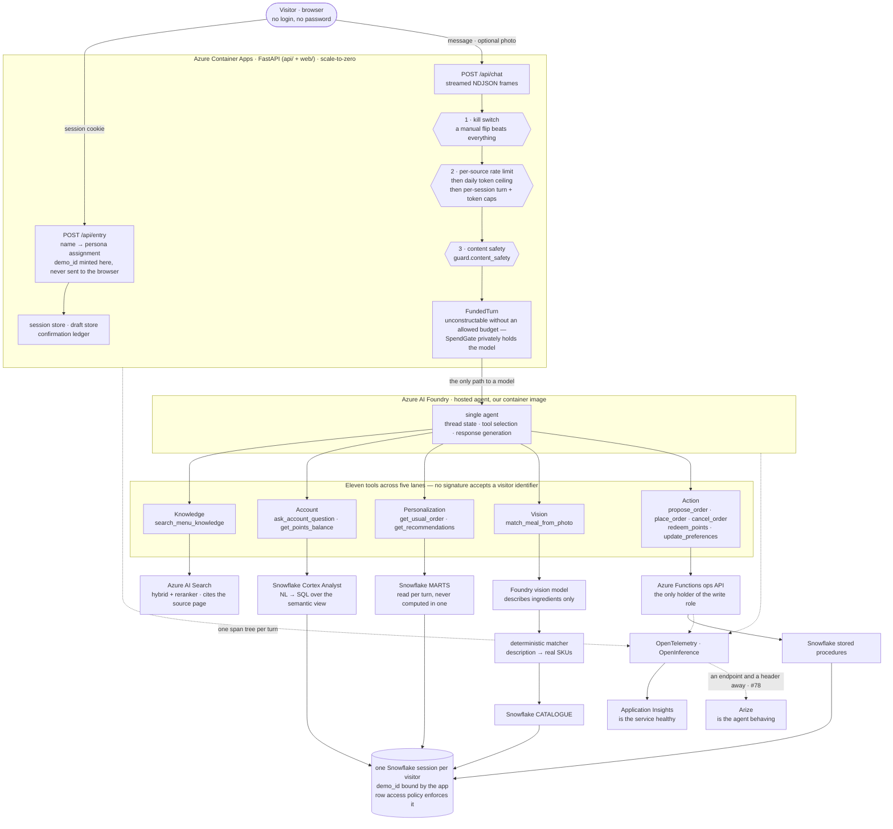
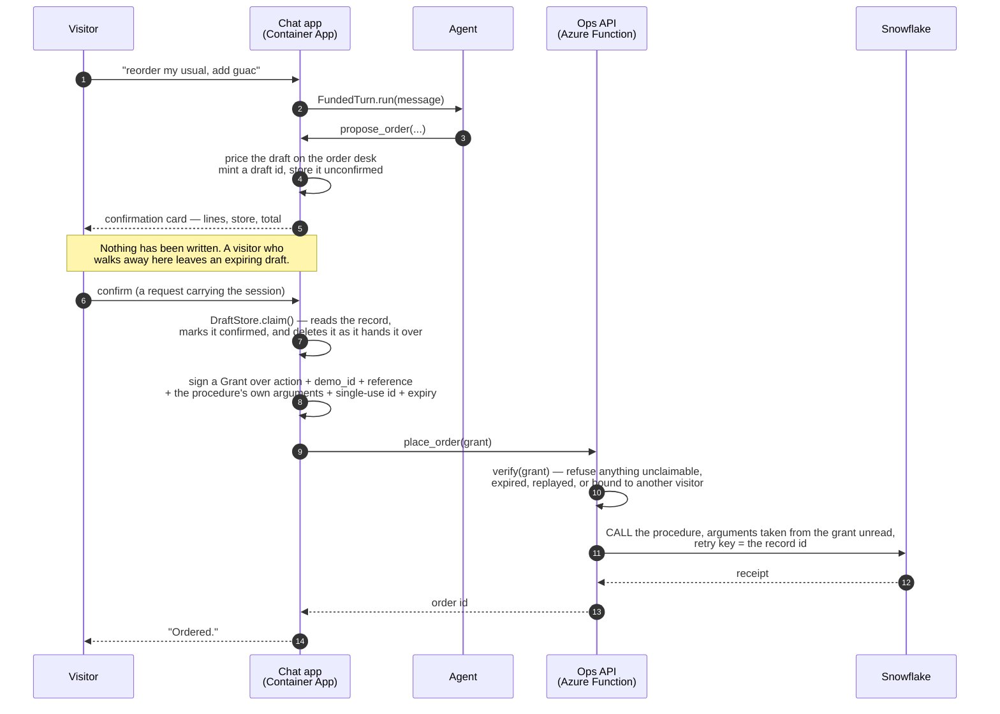

# chip_chat

A conversational assistant for a fast-casual restaurant, built as a learning proof of concept
across Azure AI, Snowflake, Databricks, and Arize.

The bot is called **Cilantro**. It answers questions about the menu, answers questions about your
own account, takes actions on that account, and can turn a photograph of a meal into an order.

> **This is a proof of concept.** It runs on Chipotle's publicly published menu and nutrition data
> and on entirely synthetic customer accounts — no real customer data, no real orders, no payment,
> no fulfillment. It is not affiliated with or endorsed by Chipotle Mexican Grill.

## Try it

**<https://ca-chip-chat-web.whitesea-eea6e4c0.eastus2.azurecontainerapps.io>**

There is no login. Type a name on the entry screen and you are bound to one of the synthetic demo
accounts — a home store, a points balance, an order history and a characteristic order — and the
name you typed is a display name on that generated customer and nothing else. The container is
scaled to zero when nobody is looking, so the first request after a quiet spell waits on a cold
start; the second one does not.

`GET /healthz/lanes` on the same host reports which of the five lanes the deployment can actually
serve, and today two of them can: the account and personalization lanes answer from the live
Snowflake serving layer, and the knowledge, photo and action lanes report `not_wired`. That is a
state the health route is designed to express rather than a failure — see [Status](#status) below for what
each one is waiting on, and [`docs/deployment.md`](docs/deployment.md) for how the app got onto
that URL and the twelve things that did not work the way the documentation implied.

## Documents

The three plans:

| Document | What it covers |
| --- | --- |
| [System design & build plan](docs/system-design.md) | Architecture, the five capability lanes, twelve-phase build plan, cost guardrails |
| [Cilantro PRD](docs/cilantro-prd.md) | Problem, personas, goals and non-goals, requirements, flows, success metrics |
| [RFC-001 — Chip Chat](docs/rfc-001.md) | Components, data model, trust boundaries, tool contracts, failure modes, decisions |

Read them in that order. The system design frames the problem, the PRD defines what to build, and
the RFC defines how. Where two of them disagree, whichever one owns the subject wins.

They are no longer the whole of [`docs/`](docs/README.md), which now holds thirty-odd write-ups
and a `decisions/` directory. Six worth knowing by name:

| | |
| --- | --- |
| [deployment.md](docs/deployment.md) | Getting the app onto the public URL, and the twelve things that did not work the way the documentation implies |
| [runbook.md](docs/runbook.md) | Kill switch, rollback, scale, demo reset, teardown, rebuild, incident triage — written to be run from a phone |
| [cost.md](docs/cost.md) | What one conversation costs across four platforms, and the guardrail audit |
| [red-team.md](docs/red-team.md) | Both launch gates, attacked rather than argued |
| [failure-isolation.md](docs/failure-isolation.md) | Which lane goes down when which dependency does |
| [decisions/](docs/decisions/) | One file per question the plans left open |

[`docs/README.md`](docs/README.md) is the index, and it explains what kind of document each one is.

## Architecture in one paragraph

Two clocks. **Nightly**, Databricks ingests two sources — Chipotle's published menu pages and a
seeded generator of synthetic accounts — through a medallion lakehouse in Unity Catalog, then
publishes a chunked knowledge index to Azure AI Search and personalization gold marts to Snowflake.
**Per turn**, a visitor types a name, is assigned a loaded demo persona, and talks to a single
Azure AI Foundry agent that calls eleven tools across five lanes: menu knowledge (RAG), account
questions (Snowflake Cortex Analyst), personalization (gold marts), photo matching (vision model
plus a deterministic catalogue matcher), and actions (an Azure Functions ops API). Inbound text is
moderated before it reaches the model and every write goes through a confirmation card the ops API
checks in code. Every account read and write runs over a Snowflake session whose demo identity is
bound by the app and enforced by row access policies — no tool signature accepts a visitor
identifier, at four tiers, each with its own test. Every turn emits one OpenTelemetry span tree,
exported to Application Insights for service health; the Arize half is an endpoint and a header
away and is [#78](https://github.com/gganssle/chip_chat/issues/78), not yet wired.

## Architecture in depth

The paragraph above is the whole system compressed to the point of being unfalsifiable. What
follows is the same system drawn at the level a reviewer needs: which process holds which
credential, which hop crosses a trust boundary, and where the three things that must not be
optional are actually enforced. Four pictures, because the system genuinely has four views — the
nightly data plane, the per-turn request path, the write gate, and the trace one turn leaves
behind — and no single diagram holds all four without lying about one of them.

### The nightly clock: two sources in, two serving surfaces out

Databricks is the batch and ML engine; nothing on this diagram is on the conversational path. It
runs overnight, and what it computes is what would be far too slow to compute mid-conversation.



The separation of the two streams is the fourth invariant, and it is structural in four places
rather than documented in one: `databricks/.../catalog.py` takes the stream as a **required**
argument of `schema(layer, stream)`, so you cannot name a table without first saying which
population it belongs to; `snowflake/sql/02_database.sql` puts the real catalogue and the
synthetic accounts in different schemas; `data-gen/`'s `OrderableMenu` is the only source of an
identifier in the package, which makes an invented SKU unreachable rather than merely untested;
and `web/`'s banner tells the visitor, undismissably.

Note what does *not* flow into the marts. The three fields a visitor may edit — display name,
home-store override and stated preferences — are columns on `demo_visitors`, and no pipeline under
`databricks/` selects from that table. That containment, and not a request that visitors behave,
is why an edit cannot invalidate a mart.

### The per-turn clock: one agent, eleven tools, three gates in front of them

Everything below happens while a visitor waits. The three gates run in the order drawn, and the
order is load-bearing: the kill switch and the budget refuse before anything is bought, and
moderation runs after the budget check because a turn that is already refused should not pay for a
moderation call.



Two hops on that diagram are trust boundaries rather than function calls. The first is
`FundedTurn` → agent: the agent runs in a container of its own, so one turn's trace crosses a
process boundary and carries two `service.name` values, and `make agent-image-boundary` exists to
prove it still arrives as one trace. The second is the ops API: it is a separate Azure Function
because it holds the only credentials in the system with the Snowflake write role, which is the
whole reason a compromised chat app still cannot write.

The bottom of the diagram is the first invariant. Identity is bound once, to the Snowflake
session, by the app — the model chooses *which tool* to call and never *whose data* it returns.
The absence of a `demo_id` parameter is the enforcement mechanism, and it is held at four tiers by
four separate tests: the tool surface (where `ARGUMENT_NAMES` is derived from the JSON schemas at
every depth, so a parameter added later lands in it automatically), the stored procedures, the ops
API, and every Pydantic request model being `extra="forbid"`.

### The write gate: what happens between "order it" and a row

No write happens without an explicit confirmation checked in code. Not by prompt instruction, not
by UI convention. Because the app and the ops API are two processes, the confirmation the visitor
gave in the first has to be provable in the second, and it crosses as a **signed grant**.



Three properties are what the gate is made of, and each is a test in `api/tests/test_ops.py`. The
record is read before the procedure is called, so an agent that decides to skip the confirmation
step produces a rejection and an eval failure rather than an order. What is written is what was
confirmed and not what was asked for — the arguments are built from the claimed record and are
inside the signature, so there is no field on the wire through which a model could alter an order
between the card the visitor read and the row that gets written. And idempotency is the record's
id, minted by the app and retired by the claim, which is what makes a retried procedure call
replay a stored receipt instead of writing twice.

`OpsService._write()` calls `claim()` **before a Snowflake session is acquired**. An unconfirmed,
missing or expired record ends the call there, marks the span `REJECTED` or `UNCONFIRMED`, and
reaches no procedure at all. If you ever find yourself adding "always ask before ordering" to a
system prompt as the mechanism, the mechanism is already there and you are weakening it.

### One turn, one span tree

The span vocabulary is executable, not documentary: `otel/src/chip_chat/otel/schema.py` enforces
nesting, and a tree RFC-001 does not describe raises `SpanSchemaError`. Twenty-five span names —
ten fixed, eleven `tool.<name>`, four `ops.<action>`. A photo turn that ends in an order looks
like this:

```
chat.turn                          demo id, session id, turn index
├── guard.budget_check             allowed/refused, and why — a median of 0 ms
├── guard.content_safety           the verdict on inbound text
├── vision.describe                ingredients, never SKUs
├── matcher.resolve                description → catalogue items
├── agent.step
│   ├── llm.completion             llm.token_count.* — this span IS a model call
│   ├── tool.match_meal_from_photo
│   └── tool.propose_order
├── agent.step
│   ├── llm.completion
│   └── tool.place_order
│       └── ops.place_order        confirmation state, the claimed record's id
└── render.response                chip_chat.tokens.* — a rollup over spans that CONTAIN calls
```

Those last two comments are the difference between a correct trace and a quietly wrong one.
`llm.token_count.*` belongs to spans that *are* a model call and sums across a trace to exactly
the provider's reported usage, which `assert_token_counts_sum` verifies; `chip_chat.tokens.*` is a
rollup on spans that merely *contain* model calls, and exists because Application Insights
searches attributes and does not walk trace trees. Writing the rollup under the same keys would
double-count every ancestor and destroy the property. Identity is stamped on every span rather
than only the root, because a bug report arrives with a session id at best —
[`docs/runbook.md`](docs/runbook.md) §10 is the query.

### What a lane failing does to the conversation

A lane may fail; the conversation may not. Azure AI Search going down costs the knowledge lane and
nothing else; Snowflake going down costs account, personalization and action, and leaves knowledge
and vision answering; the ops API going down costs writes only, and the card that says so is
`unavailable_card` rather than an exception a read lane ever sees.
[`docs/failure-isolation.md`](docs/failure-isolation.md) has the blast radius of each dependency
and the test that verifies it.

## The five lanes

| Lane | Example | Path |
| --- | --- | --- |
| Knowledge | "Is the barbacoa spicy?" | Hybrid RAG over the real published menu |
| Account | "How many points do I have?" | NL→SQL via Cortex Analyst |
| Action | "Reorder my usual, add guac" | Ops API → Snowflake procs, behind a confirmation card |
| Personalization | "What's my usual?" | Databricks gold marts, computed nightly |
| Vision | "Make me what's in this photo" | Vision model describes → matcher resolves SKUs |

## Repository layout

```
infra/        Terraform for all Azure resources
harvest/      Public menu, nutrition, and policy ingestion
catalog/      The consolidated menu catalogue: what is orderable
data-gen/     Seeded synthetic account generator
databricks/   Unity Catalog medallion pipelines, MLflow recommender
snowflake/    Schema, RBAC, row access policies, semantic view, stored procs
search/       The retrieval index: chunk schema, vectorization, alias-swap rebuilds
agent/        Hosted agent: the container image, its version manifest, the tools
vision/       Photo pipeline: validate, moderate, describe, match
api/          FastAPI service, sessions, budget enforcement, ops API
web/          Chat widget and entry flow
eval/         Eight suites: golden, adversarial, photos, trajectory, grounding,
              retrieval, dietary, dataset — each with a committed BASELINE.md
otel/         Shared OpenInference instrumentation
```

Thirteen directories, each a uv workspace member holding one importable package
under `src/chip_chat/`, sharing a single lockfile at the repository root.
`otel/` is a leaf: everything may import it, it imports nothing, and
`make imports` enforces that. **Every one of them has a `README.md`** saying what
it owns and how to run it. See
[`docs/README.md`](docs/README.md#repository-conventions) for the conventions and
[`CLAUDE.md`](CLAUDE.md) for the invariants.

The Azure account this all bills to — subscription and tenant ids, resource group,
Key Vault URI, and the monthly budget guarding it — is recorded in
[`infra/README.md`](infra/README.md).

## Getting started

```bash
make setup      # fresh clone -> working state (needs uv on PATH)
make ci         # format check, lint, type check, import contracts, tests
make dev        # start the local stack and send one instrumented turn through it
make deploy     # roll the chat app onto the public URL (see docs/deployment.md)
make help       # everything else
```

`make help` is not a formality — there are about eighty targets in ten families:
`infra-*` (Terraform), `search-*` (the retrieval index), `snowflake-*` (the serving layer),
`agent-image-*`, `verify-*`, the eight eval suites, `reharvest`/`freshness`, and the deploy,
rollback and takedown group that [`docs/runbook.md`](docs/runbook.md) documents. Anything whose
help text says **free** costs nothing and needs no credential; everything else does one or both,
which is why none of it is in `make ci`.

`make dev` brings up Phoenix — the agent-observability backend, in a container —
and sends it a session that exercises every span in the schema, so the trace tree
is there to read the first time you open <http://localhost:6006>. Tracing is not a
late deliverable here: it is how you find out why something does not work.
[`docs/local-tracing.md`](docs/local-tracing.md) explains the loop and how to read
what you see.

The agent runs in a container of its own, so one turn's trace crosses a process
boundary and carries two `service.name` values. `make agent-image-boundary` builds
that image and sends one turn through it — the app half here, the agent half in
the container — and it should arrive as **one** trace.
[`agent/README.md`](agent/README.md) is that story end to end.

[`docs/local-setup.md`](docs/local-setup.md) takes it from a clean machine: the `az`,
`terraform`, `databricks` and `snow` CLIs, how each one authenticates, and the single rule
for how secrets reach a local process.

## Status

> **⏳ The Snowflake trial expires 2026-09-24.** Started 2026-08-25 on AWS us-east-2, Enterprise,
> 30 days or roughly $400 of credits — whichever runs out first. The serving layer is the account
> and action lanes, so the clock is the demo's clock.
> [`docs/snowflake-account.md`](docs/snowflake-account.md) §10 has the burn against the allowance
> and the plan for the morning of the 25th.

**The app is live** at
<https://ca-chip-chat-web.whitesea-eea6e4c0.eastus2.azurecontainerapps.io>, on revision
`0000018`, scaled to zero when nobody is looking. The link is published at the top of this file;
it has not been circulated beyond it, because the roadmap is explicit that deploying and sharing
are different things, and [`docs/deployment.md`](docs/deployment.md) §5 lists what still has to be
true before it is.

**The foundations and the data are built.** The real Chipotle menu, nutrition and store data is
harvested and consolidated into a catalogue; a seeded generator produces 500 synthetic customers
across 30 stores with eighteen months of history; a medallion lakehouse in Unity Catalog runs
four pipelines and publishes a chunked corpus to Azure AI Search and four personalization marts to
Snowflake every night. The Snowflake serving layer has its roles, row access policies, semantic
view and stored procedures, and a nightly demo reset. All five lanes, the ops API, content safety,
the public demo tier and the red-team suites exist and are tested.

**Two of the five lanes are wired onto the deployment; three are not.** `cc-lpy4` gave the app a
Snowflake connection, so `GET /healthz/lanes` reports `account` and `personalization` **up** on
revision `0000025` — personas are assigned from the live `persona_fixtures`, and
`get_points_balance`, `get_usual_order` and `ask_account_question` answer from the visitor's own
rows through the pool that binds their identity. Knowledge (`cc-e1sr`) and photo (`cc-mpd`) still
report `not_wired`, and the ops API has no functions deployed, so the action lane is unreachable
from the public URL. `not_wired` beside `healthy: true` is the correct answer and not a
contradiction.

**What that turned up.** Wiring the account lane closed the contradiction a visitor could see —
`docs/public-demo.md` §9 has the before and after transcripts — and made a narrower one
measurable: `ACCOUNTS.persona_fixtures` on the live account was loaded from a different generation
than `ACCOUNTS.orders` and `loyalty_ledger`, so the points figure in a persona's narrative can
still differ from the ledger the tool sums. Four fixtures of twenty-eight agree. That is a reload
rather than a code change, and it is the first thing to fix before the link is given to a stranger.

**What it costs, measured rather than projected.** One median conversation is about **1.6 cents**
of model tokens — inside PRD §05's $0.05 target with room. One *account question* is **$0.20**,
four times the whole per-conversation budget, because Cortex Analyst bills 67 credits per 1,000
messages. And the standing infrastructure behind the nightly marts costs about **$41.50 a month**
whether anybody talks to Cilantro or not, which at any plausible demo volume outweighs both.
[`docs/cost.md`](docs/cost.md) has the arithmetic, the reconciliation, and the guardrail audit.

The build plan runs twelve phases over roughly five weeks of evenings and weekends. Where it is,
as of **27 August 2026**:

| | closed | open |
| --- | ---: | ---: |
| `P0` Foundation and blockers | 16 | 2 |
| `P1` Data foundations | 29 | 2 |
| `P2` The five lanes, the agent, the public app | 19 | 6 |
| `P3` Evaluation and hardening | 6 | 9 |
| `P4` Cost, operations, documentation | 1 | 5 |
| `P5` Deferred past V0 | 0 | 6 |

The work is filed as GitHub issues, each carrying exactly one priority label that encodes
implementation order. Label definitions live in [`.github/labels.yml`](.github/labels.yml).

| Label | What it covers |
| --- | --- |
| `P0` | Foundation and blockers — accounts, Terraform, the span schema, the week-one slice, the spend cap |
| `P1` | Data foundations — harvest, synthetic generator, Databricks lakehouse, Snowflake serving layer |
| `P2` | The five lanes, the agent, and the public app |
| `P3` | Evaluation and hardening, including both launch gates |
| `P4` | Cost, operations and documentation |
| `P5` | Deferred past V0 — V1 features and the named RFC revisit triggers |

Two ordering notes that override a strict reading of the labels. The **week-one ugly slice** cut
across every phase on purpose and was P0 for that reason. And the **inline spend cap** shipped
before the URL was shared with anyone rather than waiting for the Phase 10 hardening checklist;
it is in the request path today, and `guard.budget_check` costs a median of 0 ms across the
deployed spans.

## Four things not to get wrong

[`CLAUDE.md`](CLAUDE.md) is the long form, with the file and test enforcing each one. In short:

1. **Identity is never a tool argument.** It is bound to the Snowflake session by the app and
   enforced by row access policies. The absence of the parameter is the enforcement mechanism.
2. **No write without explicit confirmation**, checked in the ops API in code — not by prompt
   instruction and not by UI convention.
3. **The spend cap is inline, not observability.** A public endpoint with no authentication needs a
   synchronous budget check in front of every model call. Azure budget alerts notify after the fact;
   Arize reports what was spent. Neither prevents anything.
4. **Real published menu, entirely synthetic accounts.** Everything Cilantro says about food comes
   from what the restaurant publishes; everything it says about "you" comes from a generated
   customer. Never blur them.
